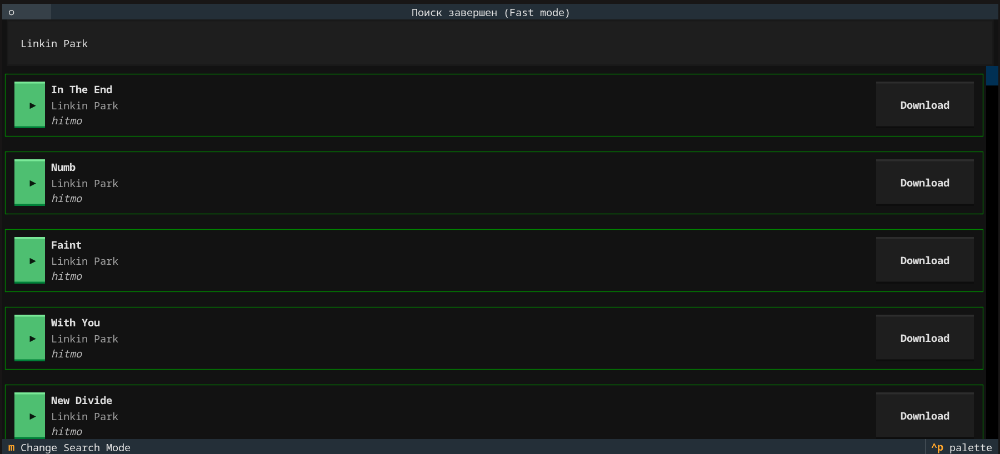

<div align="center">

# 🎵 MSOC - Библиотека для быстрого и асинхронного поиска музыки

[](https://www.python.org/downloads/)
[](LICENSE)
[](https://pypi.org/project/msoc/)
[](https://pypi.org/project/msoc/)

</div>

## ✨ Особенности
- ⚡ Асинхронный поиск музыки
- 🔍 Поддержка нескольких источников
- 🛠️ Простое расширение новыми движками
- 📦 Легкая интеграция в проекты
- 🚀 Быстрая установка через pip
- 🖥️ TUI (Terminal User Interface) с поиском, прослушиванием и скачиванием

---

# 📦 Установка

Для установки библиотеки можно использовать pip:
```bash
pip install msoc
```

Так же можно установить из исходников:
```bash
git clone https://github.com/paranoik1/msoc.git

cd MSOC

pip install .
```

# 🚀 Использование

## 🖥️ TUI (Textual User Interface)

Запустите TUI для интерактивного поиска, прослушивания и скачивания музыки:
```shell
msoc --tui
# or
python -m msoc --tui
```



TUI позволяет:
- Искать треки по запросу
- Прослушивать треки через ffmpeg (автоопределение PulseAudio/PipeWire)
- Скачивать треки в текущую директорию
- Видеть продолжительность треков

> **Требование:** для работы TUI нужен ffmpeg в системе. При разработке
> использовался `ffmpeg version n8.1.2`.

### Эксперименты с оптимизацией

В процессе разработки я экспериментировал с тем, как уменьшить количество
сетевых запросов при проигрывании. Для тестов использовал
[wondershaper](https://github.com/magnific0/wondershaper) — под Linuх он
позволяет искусственно резать пропускную способность интерфейса, что удобно
симулировать слабый интернет.

Сейчас воспроизведение выглядит так:

1. **ffmpeg скачивает трек во временную папку** (`-c:a copy` — без
   перекодирования, просто сохраняет поток как есть).
2. **Второй ffmpeg читает уже локальный файл**, декодирует в PCM
   и отправляет в sounddevice.

Загрузка и воспроизведение работают в разных потоках, поэтому не блокируют
друг друга — можно начать слушать, не дожидаясь полной загрузки.

Что хочется доделать: сейчас длительность и другие метаданные вытаскиваются
отдельным вызовом ffprobe (по сути — ещё один запрос к недокачанному файлу).
Планирую парсить `stderr` первого ffmpeg, чтобы получать ту же информацию
без лишних походов в сеть.

#### Как работает скачивание

Когда пользователь нажимает Download, логика такая:

- **Если трек уже загружен во временную папку** (докачался во время
  прослушивания) — просто копируем оттуда в текущую директорию.
  Никаких новых запросов в сеть.
- **Если трек прямо сейчас играет, но ещё не докачался** — ждём, пока
  фоновый ffmpeg закончит, и копируем. Пользователь видит `...` на кнопке.
- **Если трек не играл и не загружался** — ffmpeg скачивает напрямую
  (`-c:a copy`), сохраняя в текущую папку.

## 💻 В консоле

Можно протестировать пакет обычным скриптом:
```shell
msoc <query or empty>
# or
python -m msoc <query or empty>
```

При запуске будет выведена информация о найденных треках: `Name`, `Artist`, `URL`, `Engine` (название движка) и `Meta` (дополнительные метаданные).

## ⌨️ В коде

Импортируйте модуль msoc и используйте функцию search() для поиска музыки:

```python
from msoc import search
import asyncio


async def main():
    query = input("Запрос: ")

    async for sound in search(query):
        print(f"Name: {sound.title}\nArtist: {sound.artist}\nURL: {sound.url}")
        print("================================================")


asyncio.run(main())
```

Функция `search()` принимает поисковый запрос и опциональный параметр `mode` (по умолчанию `Mode.Fast`):

- **`Mode.Fast`** — каждый движок выполняет только первый запрос (одна страница результатов).
- **`Mode.Full`** — движок пытается собрать все страницы результатов через функцию `search_full`. Если движок не реализует `search_full`, используется обычный `search` с предупреждением.

```python
from msoc import search, Mode

async for sound in search("query", mode=Mode.Full):
    ...
```

В CLI режим задаётся флагом `--mode`:
```shell
msoc --tui --mode full
msoc "query" --mode fast
```

## 🎶 Класс Sound

Класс `Sound` содержит информацию о песне.

| Поле | Тип | Описание |
|------|-----|----------|
| `title` | `str` | Название песни |
| `url` | `str` | Ссылка на скачивание |
| `artist` | `str \| None` | Исполнитель (опционально) |
| `meta` | `dict[str, Any]` | Дополнительные метаданные (по умолчанию `{}`) |
| `_engine` | `str \| None` | Движок-источник, заполняется автоматически |


## 🔌 Реализованные движки поиска

В настоящее время библиотека MSOC поддерживает следующие движки поиска:

- zaycev_net: Поиск на сайте [zaycev.net](https://zaycev.net)
- hitmo: Поиск на сайте [rus.hitmotop.com](https://rus.hitmotop.com) - реализован на основе [данного кода от Ushiiro82](https://github.com/Ushiiro82/MelodyHub/blob/master/parsing/hitmo_parser.py)
- muzbomb: Поиск на сайте [muzbomb.net](https://muzbomb.net/) - создан [takilow](https://github.com/takilow)

Движки загружаются автоматически при импорте пакета `msoc`.

## ❌ Exceptions

Библиотека MSOC определяет следующие исключения:

- `LoadedEngineNotFoundError`: Выбрасывается, когда движок поиска не был найден в загруженных движках.

## 🛠️ Создание своих поисковых движков
Для создания собственных поисковых движков на Python вы можете использовать следующий подход:

1. Создайте новый Python-файл для вашего поискового движка:
   - Например, создайте файл `my_search_engine.py`.

2. Определите асинхронную функцию `search(query)`, которая будет реализовывать поисковый алгоритм:
   - Реализуйте логику поиска, взаимодействуя с API или веб-страницами источников, которые вы хотите использовать.
   - Можете использовать библиотеки, такие как `aiohttp`, `beautifulsoup4` и другие, для выполнения HTTP-запросов и парсинга HTML-страниц.

Для поддержки режима `Mode.Full` движок может реализовать функцию `search_full(query)` с той же сигнатурой, что и `search`. Она должна проходить по всем страницам результатов. Если `search_full` не определена, `Mode.Full` просто использует `search` (одна страница).

Функция `search` внутри движка должна возвращать генератор объектов `Sound`.  
Пример реализации функции `search(query)` в `my_search_engine.py`:

```python
import aiohttp
from bs4 import BeautifulSoup

from msoc.sound import Sound


async def search(query: str):
    async with aiohttp.ClientSession() as session:
        async with session.get(f"https://example.com/search?q={query}") as response:
            html = await response.text()

    soup = BeautifulSoup(html, "html.parser")

    for item in soup.find_all("div", class_="search-result"):
        name = item.find("h3").get_text(strip=True)
        artist = item.find("span", class_="artist").get_text(strip=True)
        url = item.find("a").get("href")
        yield Sound(name, url, artist)
```

3. Подключите ваш поисковый движок к системе:

```python
from msoc import register_engine, get_engines

import my_search_engine


register_engine("my_search_engine", my_search_engine)
print(get_engines())
```
   - Замените `my_search_engine` на название вашего python файла.
   - Далее вызываем `get_engines()`, чтобы удостовериться, что движок был успешно загружен

4. Теперь при запуске основной `search` функции, ваш движок будет автоматически загружен и использован для поиска песен

### ℹ️ P.S 1
Если вам нужно подключить поисковой движок, файл которого находится не в текущей папке проекта, можете воспользоваться встроенным python пакетом `importlib`

```python
from msoc import register_engine
from importlib import util

spec = util.spec_from_file_location("my_search_engine", "/path/to/python/file/my_search_engine.py")
module = util.module_from_spec(spec)

spec.loader.exec_module(module)


register_engine("my_search_engine", module)
```

### ℹ️ P.S 2
Если вам не нужен какой либо поисковой движок, используй `unload_search_engine` для его удаления из загруженных:

```python
from msoc import unload_search_engine, engines

unload_search_engine("my_search_engine")
print(engines())
```

### ℹ️ P.S 3 — Проверка доступности сервиса
Проверка доступности теперь лежит на самом движке. Если сайт недоступен, движок должен сам обработать ошибку в `search()` (логирование, возврат пустого результата и т.д.). `msoc` не делает отдельного запроса для проверки — лишний сетевой вызов только замедляет поиск. Переменная `URL` в модуле движка теперь используется только как константа внутри самого движка.

## 🤝 Contribution

Если вы хотите внести свой вклад в развитие библиотеки MSOC, вы можете:

- 🐞 Сообщить об ошибках или предложить новые функции
- 🎛️ Разработать и добавить новые движки поиска
- 📖 Улучшить документацию
- 🔧 Исправить существующие проблемы


<div align="center">
  
[](https://github.com/paranoik1/msoc/issues)
[](https://github.com/paranoik1/msoc/stargazers)

</div>
